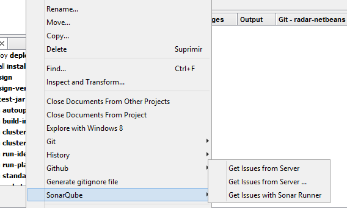
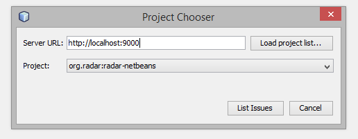
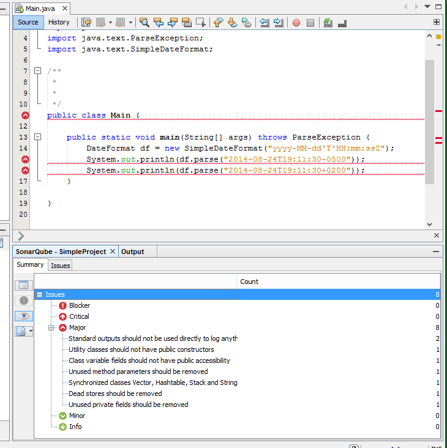
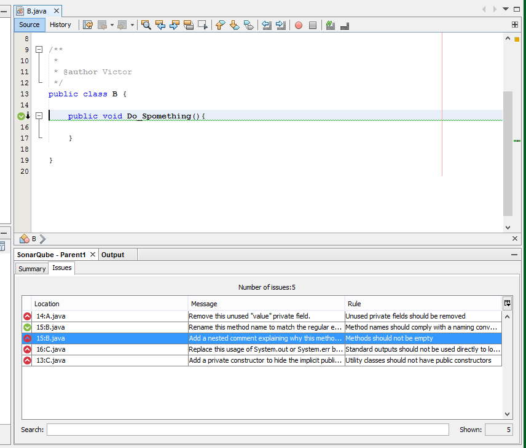
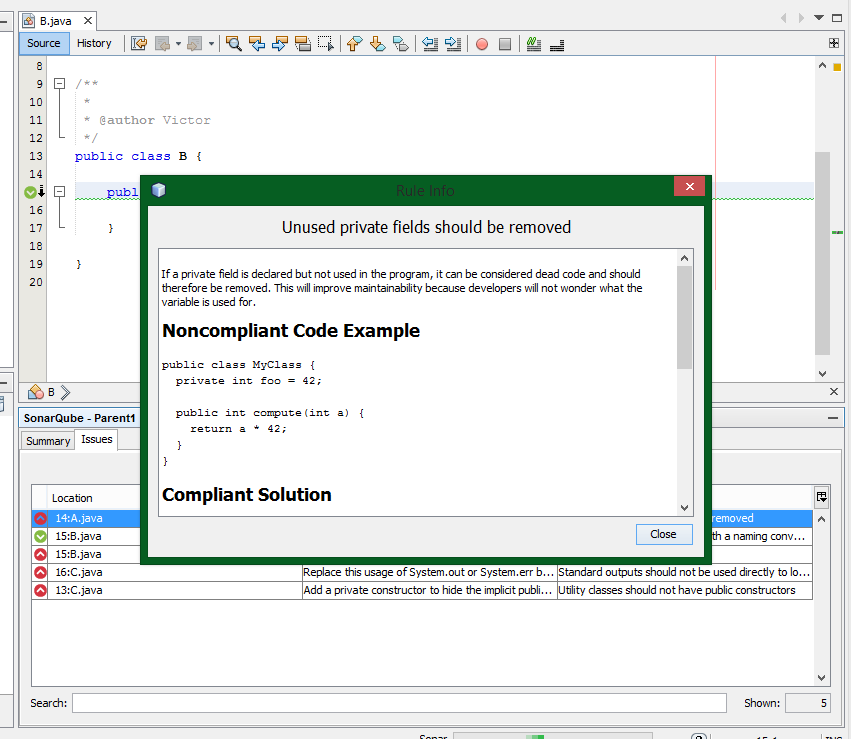

# Radar

Radar is a plugin for Netbeans to navigate directly from the issue to the code without leaving your IDE.

You can retrieve issues from a server or you can run a local analysis.

## Configuration

You can configure the url of your SonarQube server (default is localhost, port 9000).

For local analysis, you can choose if you want to use preview or incremental mode. See more information about SonarQube Runner analysis mode in: http://docs.codehaus.org/display/SONAR/Concepts#Concepts-AnalysisModes

Also, you can set JVM arguments for sonar runner proccess (For example, max memory heap space).

## Seeing issues

To see the SonarQube issues just invoke the contextual menu (or from Sources menu) in your Java Maven project and choose how you get your issues. 

These are the ways to retrieve the issues:

### Get Issues From Server

Get the issues from a remote server. The analysis was previous done and statistics are already in the server. Uses the url already configured.
The key of the project is automatically generated from the maven pom.

For a multimodule project you have to invoke the action in the main parent project.

### Get Issues From Server ...

Same as previous but a dialog appears that allows you to use a different server url and choose a different project key in the server.

Same note for multimodule project applies too.

### Get Issues with Sonar Runner

This analysis is made locally with SonarQube Runner. A connection to the server is yet required to download the quality profile.

## See the issues

So, after choosing the way to retrieve issues and some processing, a count of your issues will appear. The count is shown by severity and by rule.

Note: For remote retrieving of issues, you can filter your issues by action plan if there is any.

To see the issues for a particular category, select and click in List issues and a table with the issues will be shown. From here you can go to the code 
right-clicking a row.

If you wanna see more information about a rule, select it from the Summary view and click the button *Show Information*. A dialog will open and show more documentation about the rule.

# Notes

Before calling Sonar runner from this plugin, clean and build the project.

The plugin uses de web service API of sonar for remote retrieving of issues, so there can be some limitations on amount of displayed information. For example, at this moment, the maximum number of retrieved issues per request is 10,000.

It works from SonarQube 3.7 to SonarQube 5.1.

# Download

You can download Radar [Here](http://plugins.netbeans.org/plugin/51532/radar-netbeans here)
